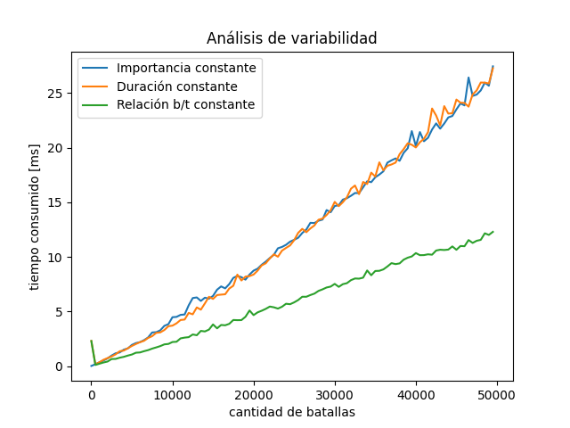

# Objetivo

El objetivo del presente trabajo es idear un algoritmo para el Señor del Fuego que logre determinar el orden óptimo en el que debe llevar a cabo un conjunto de batallas. Dicho algoritmo debe implementarse de forma Greedy. Además, se brindará un análisis completo del problema y del algoritmo en cuestión.

## Análisis del Problema

Se nos pide ordenar un total de $n$ batallas, donde cada batalla $B_{i}$ consta de dos atributos:
- $b_{i}$ : la importancia de la batalla, es un numero real no negativo.
- $t_{i}$ : el tiempo necesario para ganar la batalla, un real positivo.

Además, se define la felicidad producida por la victoria ${j}$ como $F_{j} = F_{i} + t_{j}$ , donde $F_{i}$ corresponde a la batalla anterior ($F_{j} = t_{j}$ para la primera batalla).
Se define como el orden óptimo de batallas a aquel orden tal que minimiza la siguiente suma:

$$
 \sum_{i=1}^{n}b_{i}\cdot F_{i}
$$

Podemos desarrollar esta suma para observar como afecta la magnitud de $b_{i}$ y $t_{i}$:

$$
\sum_{i=1}^{n}b_{i}\cdot F_{i} = b_{1}\cdot F_{1} + b_{2} \cdot F_{2} + b_{3} \cdot F_{3} + ... + b_{n} \cdot F_{n} \newline
=b_{1} \cdot t_{1} + b_{2}\cdot \left(t_{1} + t_{2}\right) + b_{3}\cdot \left(t_{1} + t_{2} + t_{3}\right) + \cdots + b_{n} \cdot \sum_{i=1}^{n}t_{i}
$$

En este punto se puede ver que el término que acompaña a cada $b_{i}$ va *creciendo*, siendo $b_{n}$ (i.e. la importancia de la última batalla), el término mas afectado. 
Ahora, sigamos desarrollando la suma, en esta ocasión distribuyendo $b_{i}$:

$$
\sum_{i=1}^{n}b_{i}\cdot F_{i} =b_{1} \cdot t_{1} + b_{2}\cdot \left(t_{1} + t_{2}\right) + b_{3}\cdot \left(t_{1} + t_{2} + t_{3}\right) + \cdots + b_{n} \cdot \sum_{i=1}^{n}t_{i} \newline
= t_{1}\sum_{i=1}^{n}b_{i} + t_{2}\sum_{i=2}^{n}b_{i} + t_{3}\sum_{i=3}^{n}b_{i} + \cdots + t_{n}\cdot b_{n}
$$

En este caso notamos que los términos que acompañan a cada $t_{i}$ van *disminuyendo*, por ende el $t_{i}$ más afectado será el $t_{1}$ (i.e. el tiempo necesario de la primer batalla). 

Luego, llegamos a dos conclusiones:
- Si obviamos la importancia de las batallas, estas se deben ordenar en forma ascendiente según el tiempo de duración ("las más cortas primero"). 
- Si obviamos la duración de las batallas, debemos ordenarlas de manera descendiente según la importancia ("las más importantes primero").

Si bien esto nos da un indicio de hacia donde debemos encarar el problema, no es suficiente, pues no podemos simplemente ignorar una parte entera del mismo. Entonces, deberíamos buscar una forma que cumpla esta relación lo mejor posible.
Luego, proponemos el siguiente algoritmo:

1. Ordenamos las batallas de mayor a menor según la relación $b_{i}/t_{i}$. Este será el orden óptimo en el que se deberán llevar a cabo las batallas.
2. Calculamos el *coeficiente de impacto*, para eso iteramos sobre las batallas y aplicamos una *regla sencilla*:  por cada batalla calcularemos el termino $b_{i}\cdot F_{i}$, y los iremos acumulando hasta terminar la iteración.

### Demostración mediante inversiones

Sea $a_{i} = b_{i}/t_{i}$. Consideremos la solucion A obtenida mediante nuestro algoritmo, diremos que una solucion A' tiene una *inversion*, si hay un par de batallas $i$ y $j$ tal que $i$ se realiza antes que $j$, pero $a_{i} < a_{j}$. Por su funcionamiento, el A producido por nuestro algoritmo no tiene inversiones.
Luego, para demostrar que nuestro algoritmo es óptimo, debemos demostrar lo siguiente:
1. Dos soluciones distintas sin inversiones tienen el mismo coeficiente de impacto.
2. Existe una solucion óptima sin inversiones.

#### *Dos soluciones distintas sin inversiones tienen el mismo coeficiente de impacto.*

Si dos soluciones ofrecen un orden de batalla distinto, y no tienen inversiones, entonces solo puede diferir el orden en el que se realizan batallas de igual $a$.

$$
S = \sum_{x=1}^{n}b_{x}\cdot F_{x} = \cdots + b_{i}\cdot F_{i} + b_{j}\cdot F_{j} + \cdots = \cdots + b_{i}\left(F_{k} + t_{i}\right) + b_{j}\left(F_{k} + t_{i} + t_{j}\right) + \cdots = \cdots + b_{i}\cdot F_{k} + b_{i}\cdot t_{i} + b_{j}\cdot F_{k} + b_{j}\cdot t_{i} + b_{j}\cdot t_{j} + \cdots
$$

$$
S' = \sum_{x=1}^{n}b_{x}\cdot F_{x} = \cdots + b_{j}\cdot f_{j} + b_{i}\cdot f_{i} + \cdots = \cdots + b_{j}\left(F_{k} + t_{j}\right) + b_{i}\left(F_{k} + t_{i} + t_{j}\right) + \cdots = \cdots + b_{j}\cdot F_{k} + b_{j}\cdot t_{j} + b_{i}\cdot F_{k} + b_{i}\cdot t_{i} + b_{i}\cdot t_{j} + \cdots
$$

$$
S - S' = b_{j}t_{i} - b_{i}t_{j}
$$

Como S y S' no tienen inversiones, $a = b_{i}/t_{i} = b_{j}/t_{j}$. Además reemplazamos $b_{i}$ por $t_{i}a$ y $b_{j}$ por $t_{j}a$. Volvemos a escribir la diferencia:

$$
S - S' = t_{j}at_{i} - t_{i}at_{j} = 0 \rightarrow S = S'
$$

#### *Existe una solución óptima sin inversiones*

Consideremos la solucion $O$. Diremos que $O$ tiene al menos una inversión, ergo existe un par de batallas consecutivas $i$ y $j$ tal que $i$ precede a $j$ pero $a_{i} < a_{j}$. Si invertimos el orden de $i$ y $j$, obtenemos una nueva solución con una inversión menos. Luego debemos demostrar que esta nueva solución tiene un coeficiente de impacto no mayor al coeficiente de impacto de $O$.

El desarrollo de la diferencia se realiza de manera similar al item anterior

$$
S = \sum_{x=1}^{n}b_{x}\cdot F_{x} = \cdots + b_{i}\cdot F_{i} + b_{j}\cdot F_{j} + \cdots = \cdots + b_{i}\left(F_{k} + t_{i}\right) + b_{j}\left(F_{k} + t_{i} + t_{j}\right) + \cdots = \cdots + b_{i}\cdot F_{k} + b_{i}\cdot t_{i} + b_{j}\cdot F_{k} + b_{j}\cdot t_{i} + b_{j}\cdot t_{j} + \cdots
$$

$$
S' = \sum_{x=1}^{n}b_{x}\cdot F_{x} = \cdots + b_{j}\cdot f_{j} + b_{i}\cdot f_{i} + \cdots = \cdots + b_{j}\left(F_{k} + t_{j}\right) + b_{i}\left(F_{k} + t_{i} + t_{j}\right) + \cdots = \cdots + b_{j}\cdot F_{k} + b_{j}\cdot t_{j} + b_{i}\cdot F_{k} + b_{i}\cdot t_{i} + b_{i}\cdot t_{j} + \cdots
$$

$$
S - S' = b_{j}t_{i} - b_{i}t_{j}
$$

Reemplazamos $b_{i}$ por $t_{i}a_{i}$ y $b_{j}$ por $t_{j}a_{j}$. Luego:

$$
S - S' = t_{j}a_{j}t_{i} - t_{i}a_{i}t_{j}
$$

$$
a_{j} > a_{i} \rightarrow t_{j}a_{j} > a_{i}t_{j} \rightarrow t_{j}a_{j}t_{i} > t_{i}a_{i}t_{j} \rightarrow S - S' > 0 \rightarrow S > S'
$$

Por lo tanto, el intercambio no aumentó el coeficiente de impacto.

Finalmente, queda demostrado que la solución A producida por nuestro algoritmo produce un coeficiente de impacto óptimo.

# Algoritmo y Complejidad
A continuación expondremos el código de nuestro algoritmo junto con el respectivo análisis de complejidad.

## Implementación

```python
# Código en main.py

def get_orden_optimo(batallas):
    return sorted(batallas, reverse=True, key=lambda batalla: batalla[IMPORTANCIA]/batalla[TIEMPO])

def calcular_coeficiente_de_impacto(batallas):
    felicidad = 0
    suma = 0
    for batalla in batallas:
        felicidad += batalla[TIEMPO]
        suma += batalla[IMPORTANCIA]*felicidad
    return suma
```

## Análisis Complejidad

Inicialmente se lleva acabo un preprocesamiento que consta de cargar el dataset (archivo .txt) en una lista de tuplas, lo cual se realiza en tiempo lineal $\mathcal{O}(n)$.

Luego, el algoritmo en sí consta de dos partes:

1. Se ordenan las batallas con el criterio planteado. Considerando el uso del sort de Python, esto se hace en $\mathcal{O}(n\log{}n)$.
2. Se iteran las batallas y se realiza la suma ponderada descrita en el problema, tardando $\mathcal{O}(n)$.

Por lo tanto, la complejidad total resulta en $\mathcal{O}(n\log{}n) + \mathcal{O}(n) = \mathcal{O}(n\log{}n)$.

# Análisis variabilidad de valores

En esta sección analizaremos cómo afectan la variabilidad de $b_{i}$ y $t_{i}$ al funcionamiento de nuestro algoritmo. Para ello se propuso analizar los casos cuando las batallas tienen la misma duración, cuando poseen igual importancia, y cuando la relacion batalla-importancia es la misma para toda batalla.

#### Batallas de igual importancia

$b_{i} = b\space \forall i \in batallas$

$$
\sum_{i=1}^{n}b\cdot F_{i} = b\sum_{i=1}^{n}F_{i} = b\left(t_{1} + (t_{1} + t_{2}) + \cdots + \sum_{i=1}^{n}t_{i}\right) = b\left(n\cdot t_1{} + (n-1)\cdot t_{2} + \cdots + t_{n}\right)
$$

Se puede observar que el tiempo que más veces aparece en la suma es el de la primera batalla, por lo tanto el orden óptimo es aquel donde las batallas más cortas se luchan antes.

Podemos escribir la relacion $b_{i}/t_{i}$ de la siguiente manera: $\frac{b_{i}}{t_{i}} = \frac{b}{t_{i}}$

Sean $j$ y $k$ dos batallas tal que $t_{j} < t_{k}$("la batalla $j$ es mas corta que la batalla $k$"), entonces se observa lo siguiente:

$$
t_{j} < t_{k} \implies \frac{1}{t_{j}} > \frac{1}{t_{k}} \implies \frac{b}{t_{j}} > \frac{b}{t_{k}}
$$

Luego, al ordenar según nuestro criterio, la batalla $j$ irá antes que la batalla $k$, y en general, tal como se había observado, las batallas más cortas se pelearán antes y entonces nuestro algoritmo conserva su optimalidad.

Este caso no afecta a la complejidad de nuestro algoritmo, pues el ordenamiento debe realizarse para obtener el óptimo.

#### Batallas de igual duración
$$
t_{i} = t\space \forall i \in batallas,\space F_{j} = \sum_{i=1}^{j}t_{i} \implies F_{j} = \sum_{i=1}^{j}t = j\cdot t
$$

$$
\sum_{i=1}^{n}b_{i}\cdot F_{i} = b_{1}\cdot F_{1} + b_{2} \cdot F_{2} + \cdots + b_{n} \cdot F_{n} = b_{1} \cdot t + b_{2}\cdot (2t)+ \cdots + b_{n}\cdot (nt) = (b_{1} + 2b_{2} + \cdots + nb_{n})\cdot t
$$

Se puede ver que el $b_{i}$ con más apariciones en la suma es el $b_{n}$, por lo que buscamos que este sea el más chico. Por lo tanto la solución óptima implica luchar las batallas más importantes primero.

Podemos escribir la relacion $b_{i}/t_{i}$ de la siguiente manera: $\frac{b_{i}}{t_{i}} = \frac{b_{i}}{t}$

Sean $j$ y $k$ dos batallas tal que $b_{j} > b_{k}$("la batalla $j$ es mas importante que la batalla $k$"), entonces se observa lo siguiente:

$$
b_{j} > b_{k} \implies \frac{b_{j}}{t} > \frac{b_{k}}{t}
$$

Por ende, segun nuestro algoritmo, se peleará la batalla $j$ antes que la $k$, y en general,las batallas más importantes se pelearan antes, lo cual concuerda con lo planteado anteriormente y por ende nuestra solución sigue siendo óptima.

Al igual que el caso anterior, el ordenamiento se sigue llevando a cabo, por lo que la complejidad de nuestro algoritmo no varía.

#### Misma relacion $b_{i}/t_{i}$ para toda batalla $i$

Este se trata del que caso en el que todas las soluciones posibles *no tienen inversiones*, y tal como se demostro en la [sección correspondiente](#dos-soluciones-distintas-sin-inversiones-tienen-el-mismo-coeficiente-de-impacto), el coeficiente de impacto será el mismo para cualquier orden, ergo nuestro algoritmo encontrará el óptimo.

Además, no es necesario ordenar las batallas, por lo que estamos ante el mejor caso de nuestro algoritmo, y debido a la manera en la que se implementa el algoritmo de ordenamiento de Python, la complejidad del ordenamiento se ve reducida a $\mathcal{O}(n)$. Luego, la nueva complejidad queda $\mathcal{O}(n) + \mathcal{O}(n) = \mathcal{O}(n)$ en función de los datos de entrada.

# Mediciones

Se realizaron una serie de mediciones para visualizar la complejidad de nuestro algoritmo

Para la primer medición se fueron generando muestras aleatorias de tamaño n, con n yendo de 10 a 50000 elementos, añadiendo 500 elementos con cada iteración, y se les fue tomando el tiempo a cada muestra.


Si bien es dificil de observar, se puede notar que el grafico no tiene una tendencia lineal, en especial al probar con muestras muy grandes.

Para el siguiente grafico se repitio la experiencia anterior para los casos mencionados en el [analisis de variabilidad](#análisis-variabilidad-de-valores).



Como se puede ver en el grafico, la complejidad del algoritmo no tiene ningun cambio notable al tratar casos donde se mantiene constante una variable del problema, sin embargo podemos notar a simple vista la mejora en los tiempos de nuestro algoritmo al tratar casos donde no hay inversiones, apreciando una tendencia lineal.
